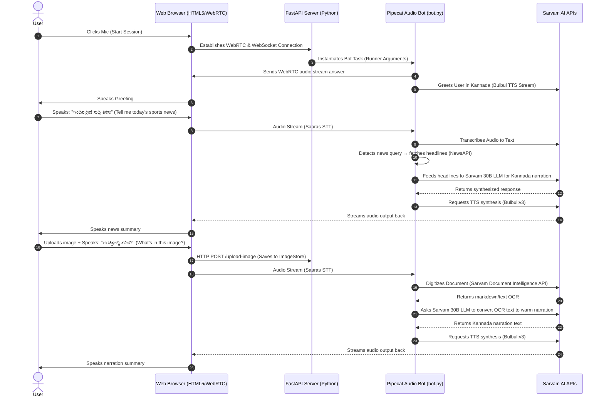

# 📻 Khabar Suno (ಖಬರ್ ಸುನೋ) — Kannada Voice & Vision AI Assistant

**Khabar Suno** is a real-time, Indic-first conversational voice and vision assistant. Built using **Pipecat**, **WebRTC**, and **Sarvam AI APIs**, the assistant is tailored for Kannada speakers to get voice-guided news bulletins and have documents or images read aloud in Kannada.

---

## 🌟 Features

1. **🎙️ Real-Time Kannada Voice Chat**: Engaging voice interactions in Kannada using Sarvam’s state-of-the-art `bulbul:v3` TTS (text-to-speech) and `saaras:v3` STT (speech-to-text) models.
2. **📰 Voice-Activated News Bulletins**: Users can ask for news (General, Karnataka, India, Sports, or Tech), and the bot retrieves headlines via NewsAPI, summarizing and announcing them like a warm radio host.
3. **📷 Document Intelligence & Vision Narration**: Upload images or documents (forms, newspapers, medicine labels), and ask the bot to read them. It uses the **Sarvam Document Intelligence SDK** to digitize the text, translates/refines it with the **Sarvam 30B LLM**, and narrates the summary back in Kannada.
4. **💬 High-Fidelity Web Interface**: A modern, glassmorphic UI with real-time audio visualization, drag-and-drop image uploading, and interactive live transcriptions.

---

## 🏗️ System Architecture & How It Connects

Below is a high-level sequence of how the front-end, backend, and Sarvam AI APIs orchestrate the real-time audio and vision pipeline:



---

## 📂 Codebase Directory Structure

* **`server.py`**: The FastAPI server. Mounts the static directory, provides the image upload endpoints, and handles WebRTC signaling/WebSocket connections.
* **`bot.py`**: The core Pipecat pipeline implementation. Configures STT (`saaras:v3`), TTS (`bulbul:v3`), and LLM (`sarvam-30b`), and registers tool handlers.
* **`vision_tool.py`**: Integration with Sarvam’s Document Intelligence Client, handling uploading, polling, and calling Sarvam LLM for image narration.
* **`news_tool.py`**: Hits NewsAPI to fetch the latest headlines for various categories.
* **`image_store.py`**: An in-memory, async-safe store to pass uploaded image data from FastAPI routes to the Pipecat background pipeline.
* **`static/index.html`**: A modern WebRTC front-end for speaking to the bot, checking transcripts, and uploading images.

---

## 🛠️ Setup & Running Locally

### 1. Prerequisites
Ensure you have **Python 3.10+** installed on your system.

### 2. Clone the Repository
```bash
git clone https://github.com/R1patil/Sarvam_AI.git
cd Sarvam_AI
```

### 3. Create a Virtual Environment & Install Dependencies
```powershell
# Create virtual environment
python -m venv venv

# Activate on Windows (PowerShell)
.\venv\Scripts\Activate.ps1

# Install requirements
pip install -r requirements.txt
```

### 4. Setup Environment Variables
Create a `.env` file in the root of the project:
```env
SARVAM_API_KEY=your_sarvam_api_subscription_key
NEWS_API_KEY=your_news_api_key
```

### 5. Run the Application
Start the FastAPI server:
```bash
python server.py
```
Open [http://localhost:8000](http://localhost:8000) in your browser to interact with the bot.

---

## 🤝 Collaborators

Developed by **Rahul Patil** (GitHub: [@R1patil](https://github.com/R1patil)).
For evaluating this assignment, collaborator access has been shared with `@vinayak-sarvam`.
