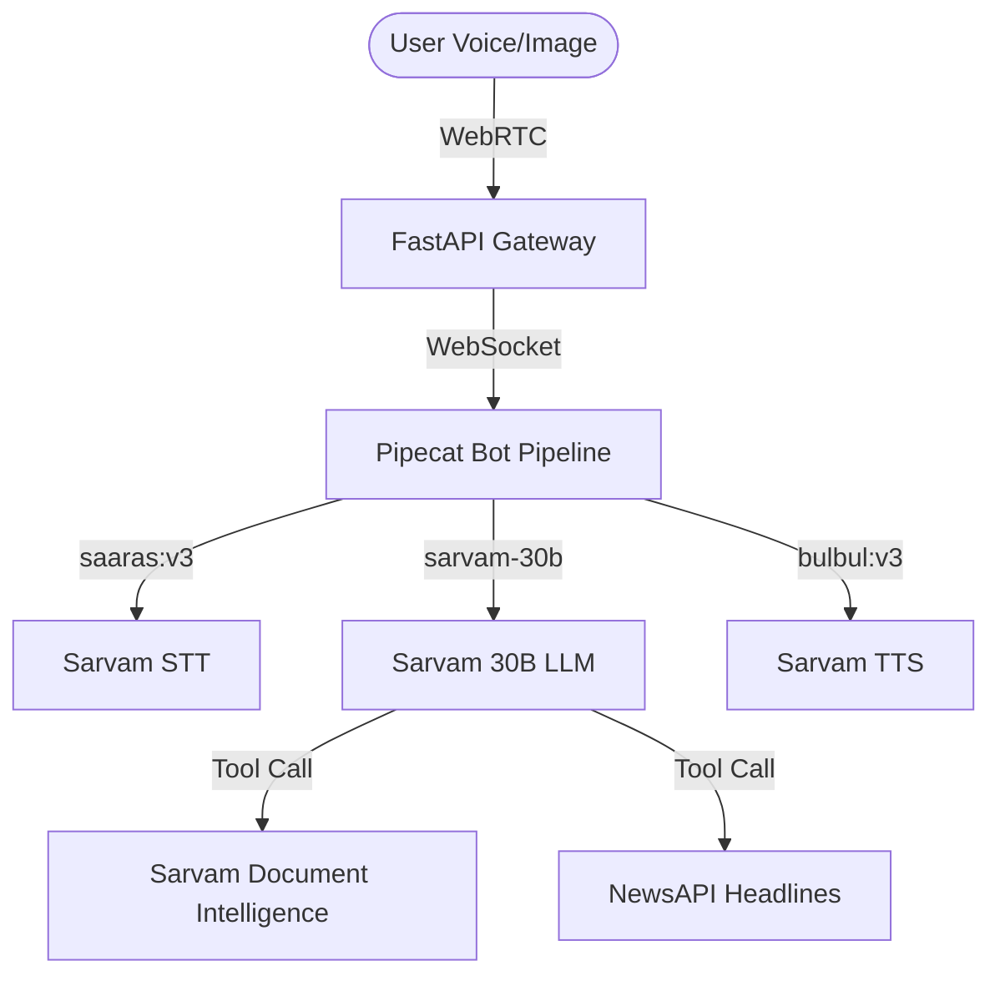

# Building "Khabar Suno": Real-Time Kannada Voice & Vision Agents with Sarvam AI

Building voice assistants for Indic languages has traditionally been a complex, fragmented puzzle. Developers often have to stitch together translation layers, generic English LLMs, and separate speech-to-text (STT) and text-to-speech (TTS) APIs. This multi-hop pipeline introduces high latency and strips away the natural tone, accent, and cultural nuances of regional languages. 

To solve this, I built **Khabar Suno (ಖಬರ್ ಸುನೋ)**—a real-time Kannada voice and vision assistant. By leveraging Sarvam AI’s native Indic models, Khabar Suno provides hands-free access to daily news summaries and uses Document Intelligence to read physical images or documents aloud in natural, conversational Kannada.

---

## The Architecture: Connecting Voice and Vision

At the core of Khabar Suno is **FastAPI** coordinating with **Pipecat**, an event-driven framework for real-time conversational agents. The backend connects directly to Sarvam’s API ecosystem:
1. **Sarvam STT (`saaras:v3`)** transcribes the user's spoken Kannada.
2. **Sarvam LLM (`sarvam-30b`)** processes the request and orchestrates tools.
3. **Sarvam TTS (`bulbul:v3`)** synthesizes the responses back into high-quality spoken audio.



---

## Design Decision: Turning Raw OCR into Natural Narration

A major challenge in building a voice-first document reader is that raw OCR text is structurally jarring when read aloud. Physical newspapers, forms, and medicine labels contain headers, columns, page numbers, and tables that sound robotic when fed directly into a TTS engine.

To solve this, I routed the output of the **Sarvam Document Intelligence SDK** (which extracts text in markdown format) through the `sarvam-30b` LLM. The LLM acts as an "editor," rewriting raw OCR layout structures into a conversational Kannada narration. Here is the asynchronous pipeline implemented in [vision_tool.py](file:///d:/khabar-suno/vision_tool.py):

```python
# Create a digitization job
job = await client.document_intelligence.create_job(
    language="kn-IN", 
    output_format="md"
)
await job.upload_file(temp_image_path)
await job.start()

# Wait for completion & download output
status = await job.wait_until_complete()
downloaded_zip = await job.download_output(output_path)
ocr_text = extract_markdown(downloaded_zip)

# Turn raw markdown OCR into a natural Kannada voice script
conversational_script = await call_sarvam_30b(
    prompt="Narrate this OCR markdown naturally in Kannada for a voice assistant.",
    content=ocr_text
)
```

By adding this LLM editing step, the bot doesn't just read words—it actively summarizes tabular data, points out key instructions on medicine labels, and explains notice boards naturally.

---

## What You Can Build Next

Sarvam AI’s low-latency, Indic-native endpoints open up massive possibilities. Other developers can easily extend Khabar Suno into:
* **Smart Health Assistants**: Helping rural users read prescription labels, explain dosages in their regional language, and automatically schedule voice-based reminders.
* **Vernacular E-learning Companions**: Interactive voice bots that scan printed textbooks and quiz children interactively.
* **Local Governance Kiosks**: Voice-operated desks in public offices to help citizens fill out forms and scan documents while receiving guided instructions.

Sarvam’s models make building rich, voice-first regional AI agents not only feasible but incredibly straightforward. Check out the codebase on [GitHub](https://github.com/R1patil/Sarvam_AI) to get started!
